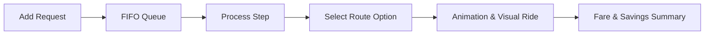

# 🚖 OttosTop - Smart Ride-Sharing & Route Optimization

[](https://bau.edu.tr/)
[](#)
[](https://www.python.org/)
[](https://flask.palletsprojects.com/)

An interactive web-based real-time simulation designed for **Bahçeşehir University's SEN2212 Data Structures** course. It models and optimizes taxi and cargo ride-sharing (carpooling) operations over a 21-stop road network of Beşiktaş, Istanbul.

---

## 🏛️ Project Context (SEN2212)
This project implements core computer science concepts to solve a practical **Vehicle Routing Problem (VRP)**:
* **Graph Representation:** Durations/distances between stops are modeled using a custom **Weighted Graph** with **Adjacency Lists**.
* **Priority Queues (Min-Heap):** Utilized by **Dijkstra's Algorithm** to compute the shortest paths efficiently.
* **FIFO Queue:** Manages passenger/cargo requests in a First-In-First-Out order.
* **Alternative Routing:** Uses **Yen's K-Shortest Paths** algorithm to offer alternative travel routes.
* **Backtracking Search:** Finds the optimal pick-up and drop-off sequences for multiple passengers.

---

## ✨ Features

### 🗺️ Interactive Canvas Map
* **Dynamic Drawing:** Rendered via HTML5 Canvas with smooth zooming and panning controls.
* **Live Animation:** Vehicles move dynamically along the paths during simulation steps.
* **Status Indicators:** Clearly color-coded nodes and vehicles showing availability states.

### 🧠 Ride-Sharing (Carpooling) Engine
* **Multi-Passenger Matching:** Groups up to **3 passengers** in a single taxi (Capacity: 3).
* **Detour Protection:** Ensures no passenger travels more than **1.5x** (or **1.3x** for 3-person rides) of their direct path distance.
* **Disjoint Filtering:** Guarantees passengers share at least one path segment inside the vehicle (no isolated back-to-back rides).

### 💳 Dynamic Fare Sharing
* **Empty Miles Exemption:** Customers are never charged for a taxi's empty dispatch path (pickup trip).
* **Proportional Splitting:** Cost (10.0 units/km) is shared fairly based on the active distance traveled by each passenger.
* **Guaranteed Savings:** Every carpool passenger receives at least a **15% discount** compared to a solo ride, and never pays more than their solo fare.

---

## 📂 Project Structure

```text
taxi_cargo_simulator/
└── OttosTop/
    ├── app.py                # Flask server exposing REST API endpoints
    ├── models.py             # Data models (Graph, Vertex, Edge, Vehicle, Customer)
    ├── simulation/           # Core Backend simulation package
    │   ├── __init__.py       # Package init
    │   ├── manager.py        # SystemManager orchestrator
    │   ├── setup.py          # Beşiktaş map data & taxi fleet bootstrap
    │   ├── routing.py        # Dijkstra & Yen's KSP algorithms
    │   └── matching.py       # Carpooling & fare optimization logic
    ├── static/               # Modular Frontend assets
    │   ├── css/style.css     # Glassmorphic UI styling & keyframe animations
    │   └── js/
    │       ├── config.js     # Map coordinates and coordinates config
    │       ├── state.js      # Zoom, pan, theme, and logs state manager
    │       ├── ui.js         # DOM updates & UI interactive elements
    │       ├── map.js        # Canvas renderer, zoom, drag, and draw helpers
    │       ├── api.js        # Server communication fetch functions
    │       └── main.js       # App bootstrapper
    └── templates/index.html  # Main application dashboard page
```

---

## ⚙️ Installation & Running

### 1. Install Dependencies
Make sure you have **Python 3.x** installed. Install Flask using pip:
```bash
pip install Flask
```

### 2. Start the Server
Navigate to the project directory and launch `app.py`:
```bash
python app.py
```

### 3. Open in Browser
Visit the following address in your browser:
```text
http://127.0.0.1:5000/
```

---

## 📖 How to Use



1. **Add Request:** Fill in the **"Yeni Çağrı / Kargo Talebi"** form to create a request, or click **"Rastgele Çağrı Talebi Gönder"** to generate one automatically.
2. **Process Step:** Click **"Sıradaki Çağrıyı İşle"** (Process Next Call).
3. **Select Route:** An interactive panel will pop up showing up to 3 optimized route suggestions. Choose one.
4. **Watch Simulation:** The assigned taxi animates along the green path on the map.
5. **View Summary:** Once completed, a detailed fare breakdown detailing individual savings is shown. Click close to proceed.
